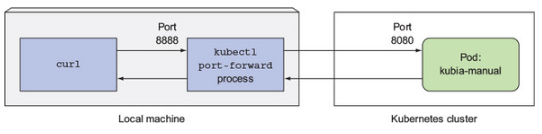
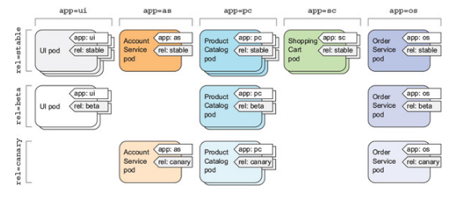

## Creating the pods

kubectl create -f kubia-manual.yaml
kubectl get po kubia-manual -o yaml
kubectl get po kubia-manual -o json
kubectl get pods

- viewing the logs
kubectl logs kubia-manual
Container specific logs
kubectl logs kubia-manual -c kubia

- Different ways to connect to a pod  

   1. kubectl expose command

   2. Port forwarding (8888 port on local machine; 8080 port on the pod)
      kubectl port-forward kubia-manual 8888:8080
      Note: This creates kubectl port-forward proxy running on localhost:8888
      
      Access the port: curl localhost:8888
      
        

### Organizing Pods

 horizontally by app and vertically by release
    
 
 app: which specifies which app, component, or microservice the pod belongs to.
 rel: which shows whether the application running in the pod is a stable, beta, or a canary release.

kubectl create -f kubia-manual-with-labels.yaml
kubectl get po --show-labels
kubectl get po -L creation_method,env
kubectl label po kubia-manual creation_method=manual
- Updating the labels
kubectl label po kubia-manual-v2 env=debug --overwrite
kubectl get po -L creation_method,env
   